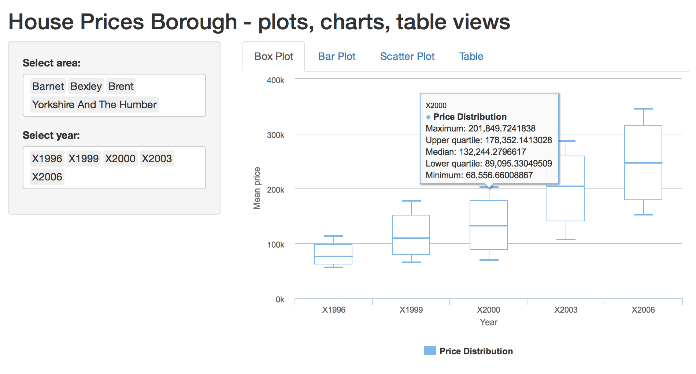
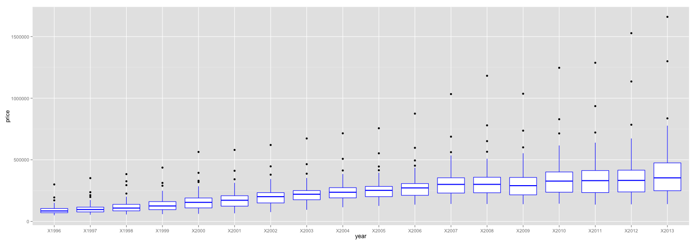

devdataprod-010 Course Project
========================================================
author: Andrey Vykhodtsev
date: 25-01-2015

Idea of the app
========================================================

To present price changes over time of houses in London

- By Region (Borough)
- By Year
- Using different types of rChart Plots and visualisations

Useful links:
- [App link](http://vykhand.shinyapps.io/devdataprod-010/)
- [App code on github](https://github.com/vykhand/devdataprod-010)
- [Data source](http://data.london.gov.uk/dataset/average-house-prices-borough)

What it allows you to do
========================================================

- filter by year or area (or leave blank to see all)
- show boxplot, scatterplot, barplot, or table
- Example (boxplot filtered by year and area) :

Distribution and growth of prices over the years
========================================================

For [some reason](https://github.com/ramnathv/rCharts/issues/571) I was not able to display rCharts on rPubs. Therefore I am showing *ggplot2* version

 

Data representation using googleVis
========================================================

<!-- MotionChart generated in R 3.1.2 by googleVis 0.5.8 package -->
<!-- Sun Jan 25 19:42:58 2015 -->

<!-- jsHeader -->

 
<!-- jsChart -->  

 
<!-- divChart -->
  

